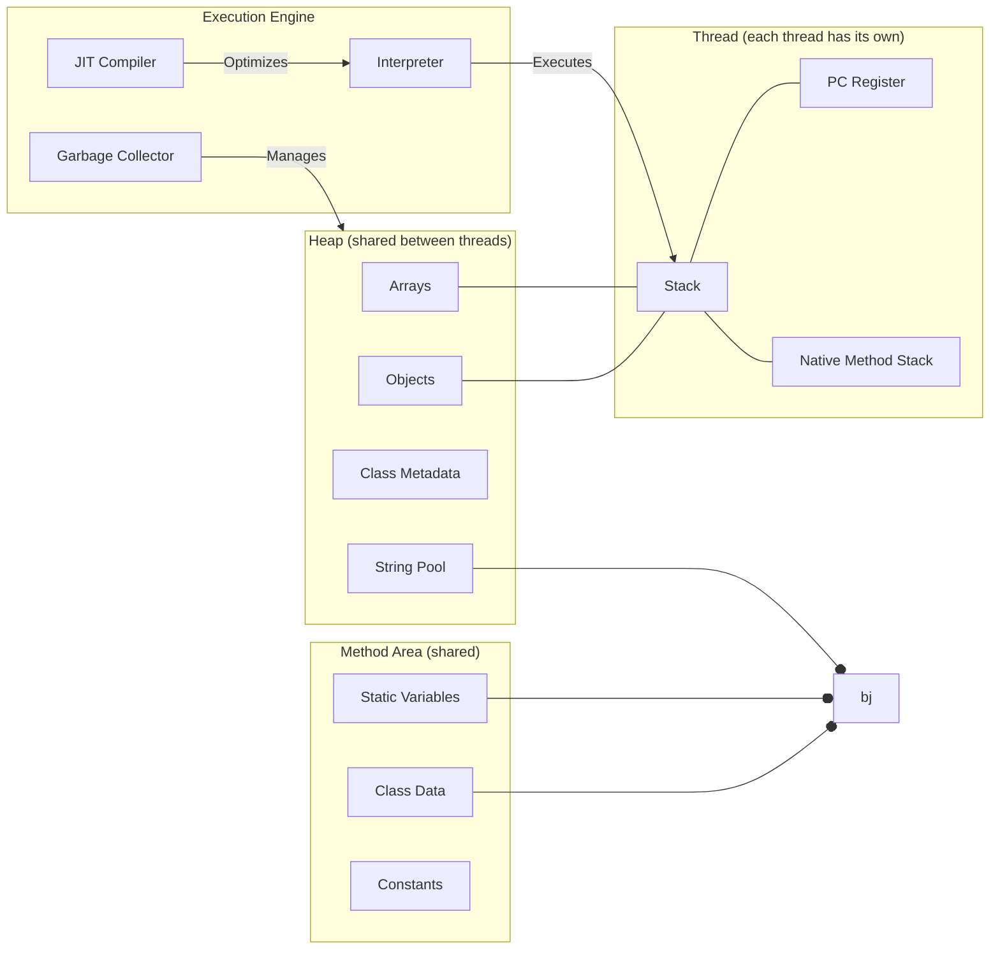

# Java-8-Interview-Coding-Questions-By-Nitin-Kumar

<h3># Java Memory Model (JMM) – Simple & In-Depth with Java 8 Updates </h3>

## Diagram

## Components Explained

### 1. **Heap**
- Stores all Java objects, arrays, class metadata, and string pool.
- **Shared by all threads.**
- **Java 8 Update:** 
  - **Metaspace replaces PermGen:** Class metadata moved from PermGen (fixed-size) to Metaspace (dynamically grows based on system memory).

### 2. **Method Area**
- Contains class structure, static variables, and constants.
- **Shared by all threads.**
- **Java 8 Update:**
  - **Metaspace** (not Heap): Stores class metadata; automatically expands.

### 3. **Stack (Thread-local)**
- Each thread has its own stack.
- Stores method frames, local variables, partial results.
- Stack frames created for each method call.

### 4. **PC Register (Thread-local)**
- Each thread’s program counter, points to current instruction.

### 5. **Native Method Stack (Thread-local)**
- For native (non-Java) method calls (e.g., JNI).

### 6. **Execution Engine**
- **Interpreter:** Executes bytecode.
- **JIT Compiler:** Converts bytecode to native code for speed.
- **Garbage Collector:** Automatically frees unused memory.

## Java 8 Memory Model Changes

- **PermGen eliminated:** No more OutOfMemoryError due to PermGen. Metaspace stores class metadata and is allocated outside the heap.
- **String Pool moved to Heap:** Improves string management and garbage collection.
- **Metaspace size can be set with JVM options** (`-XX:MetaspaceSize`, `-XX:MaxMetaspaceSize`).

## Simple Summary

- **Heap:** Where objects live; shared.
- **Method Area/Metaspace:** Where class info lives; shared.
- **Stack:** Where methods run; each thread has its own.
- **PC Register & Native Stack:** For thread execution.
- **Execution Engine:** Runs and optimizes code.

---

> **Java 8 Modernization:**  
> - PermGen replaced by Metaspace (dynamic, OS-managed).
> - String Pool moved to Heap (better GC).
> - Metaspace JVM options allow tuning.

---

Java-8-Interview-Sample-Coding-Questions

This repository contains sample Java 8 coding questions that can be used for interview preparation. Each question focuses on a specific programming concept or problem-solving technique using Java 8 features.

List of Questions
Separate odd and even numbers in a list of integers

Given a list of integers, write a Java 8 program to separate the odd and even numbers into two separate lists.

Remove duplicate elements from a list using Java 8 streams

Write a Java 8 program to remove duplicate elements from a list using the stream API and lambda expressions.

Find the frequency of each character in a string using Java 8 streams

Write a Java 8 program to find the frequency of each character in a given string using the stream API and collectors.

Find the frequency of each element in an array or a list

Write a Java 8 program to find the frequency of each element in an array or a list using streams and collectors.

Sort a given list of decimals in reverse order

Write a Java 8 program to sort a given list of decimal numbers in reverse order.

Join a list of strings with '[' as prefix, ']' as suffix, and ',' as delimiter

Given a list of strings, write a Java 8 program to join the strings with '[' as a prefix, ']' as a suffix, and ',' as a delimiter.

Print the numbers from a given list of integers that are multiples of 5

Write a Java 8 program to print the numbers from a given list of integers that are multiples of 5.

Find the maximum and minimum of a list of integers

Given a list of integers, write a Java 8 program to find the maximum and minimum numbers in the list.

Merge two unsorted arrays into a single sorted array using Java 8 streams

Write a Java 8 program to merge two unsorted arrays into a single sorted array using the stream API.

Merge two unsorted arrays into a single sorted array without duplicates

Write a Java 8 program to merge two unsorted arrays into a single sorted array without duplicates.

Get the three maximum and three minimum numbers from a given list of integers

Write a Java 8 program to get the three maximum and three minimum numbers from a given list of integers.

Check if two strings are anagrams or not using Java 8 streams

Write a Java 8 program to check if two strings are anagrams or not using the stream API and lambda expressions.

Find the sum of all digits of a number in Java 8

Write a Java 8 program to find the sum of all digits of a given number.

Find the second largest number in an integer array

Write a Java 8 program to find the second largest number in an integer array.

Sort a list of strings according to the increasing order of their length

Write a Java 8 program to sort a given list of strings according to the increasing order of their length.

Find the sum and average of all elements in an integer array

Write a Java 8 program to find the sum and average of all elements in an integer array.

Find the common elements between two arrays

Write a Java 8 program to find the common elements between two arrays using streams.

Reverse each word of a string using Java 8 streams

Write a Java 8 program to reverse each word of a given string using the stream API and lambda expressions.

Find the sum of the first 10 natural numbers

Write a Java 8 program to find the sum of the first 10 natural numbers using streams.

Reverse an integer array

Write a Java 8 program to reverse an integer array.

Print the first 10 even numbers

Write a Java 8 program to print the first 10 even numbers.

Find the most repeated element in an array

Write a Java 8 program to find the most repeated element in an array.

Check if a string is a palindrome using Java 8 streams

Write a Java 8 program to check if a given string is a palindrome using the stream API and lambda expressions.

Find strings in a list that start with a number

Given a list of strings, write a Java 8 program to find the strings that start with a number.

Extract duplicate elements from an array

Write a Java 8 program to extract duplicate elements from an array.

Print duplicate characters in a string

Write a Java 8 program to print the duplicate characters in a string.

Find the first repeated character in a string

Write a Java 8 program to find the first repeated character in a string.

Find the first non-repeated character in a string

Write a Java 8 program to find the first non-repeated character in a string.

Generate the Fibonacci series

Write a Java 8 program to generate the Fibonacci series.

Print the first 10 odd numbers

Write a Java 8 program to print the first 10 odd numbers.

Get the last element of an array

Write a Java 8 program to get the last element of an array.

Calculate the age of a person in years

Write a Java 8 program to calculate the age of a person in years given their birthday.
